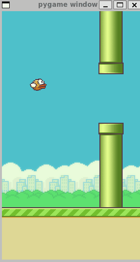

# Dreamer V1

PyTorch reproduction of [Dreamer V1](https://arxiv.org/abs/1912.01603) applied to Flappy Bird. Reuses the VAE encoder from [world_model](../world_model/) for observation compression — a deliberate simplification (the original trains a CNN encoder end-to-end as part of the world model).

## Quick Start

```bash
cd dreamer

# 1. Generate 5 random seed episodes
python generate_dreamer_data.py

# 2. Run full Dreamer online loop (200 iterations)
python train.py

# 3. Watch the trained agent play
python demo.py
```

Requires a trained VAE checkpoint at `../world_model/checkpoints/vae_encoder.pth`.

## Supplement

The original version uses the CNN Policy to collect data, without data collecting - training loop, which led to poor performance.

<table>
  <tr>
    <td></td>
    <td></td>
    <td></td>
  </tr>
</table>

Then we finally reproduced a true "dreamer" version.

<table>
  <tr>
    <td></td>
    <td></td>
    <td></td>
  </tr>
</table>