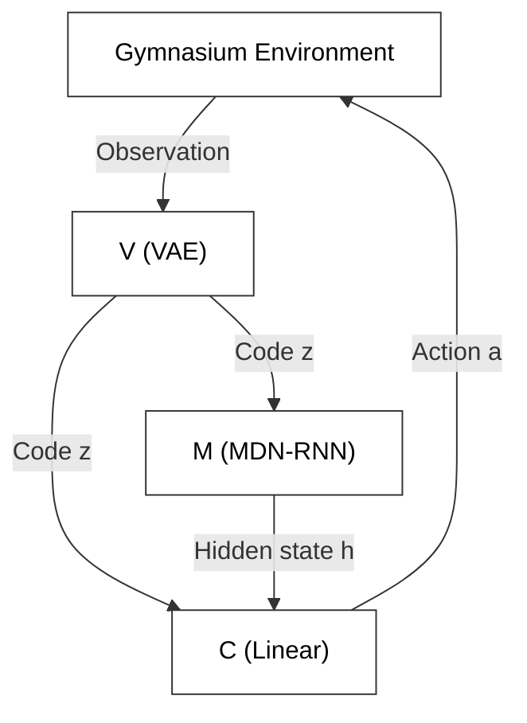

# World Model

This folder applies [world model 2018](https://arxiv.org/abs/1803.10122) to the Flappy Bird game. Our implementation is informed by [world-models](https://github.com/ctallec/world-models), a PyTorch reproduction of the original paper.

## Architecture Overview

The following graph demonstrate the main architecture of the model.

