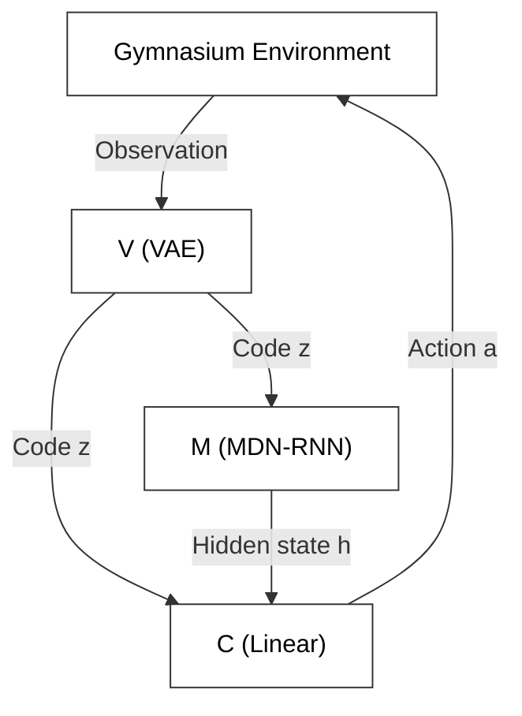
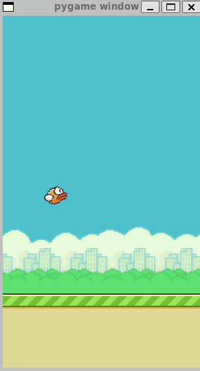
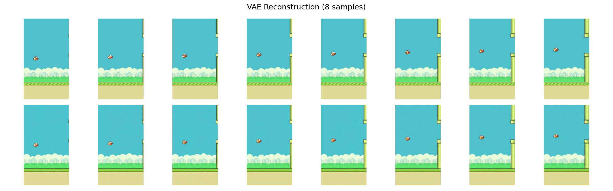

# World Model

This folder applies [world model 2018](https://arxiv.org/abs/1803.10122) to the Flappy Bird game. Our implementation is informed by [world-models](https://github.com/ctallec/world-models), a PyTorch reproduction of the original paper.

## Architecture Overview

The following graph demonstrate the main architecture of the model.



## Quick Start

Run the following line to navigate to the working directory.
```bash
cd world_model
```

run the commands to generate training data (a pretrained CNN model is required).
```bash
python generate_vae_data.py
python generate_mdnrnn_data.py
```

run the following commands to train the components separately.
```bash
python train_vae.py
python train_mdn_rnn.py
python train_controller.py
```

run it to watch AI play the game.
```bash
python world_model_demo.py
```



## Appendix

Here is a VAE reconstruction picture.

